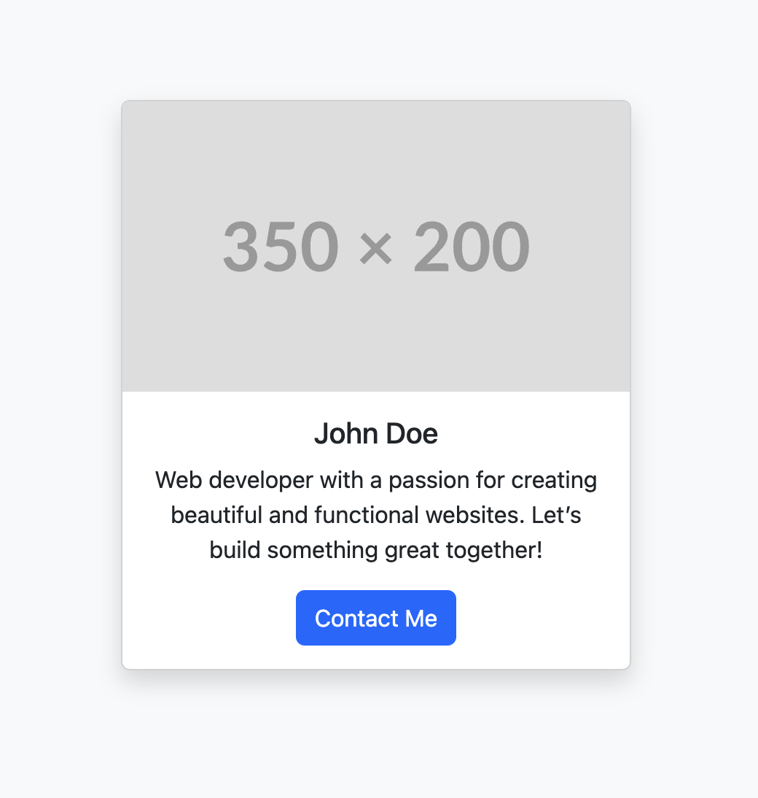
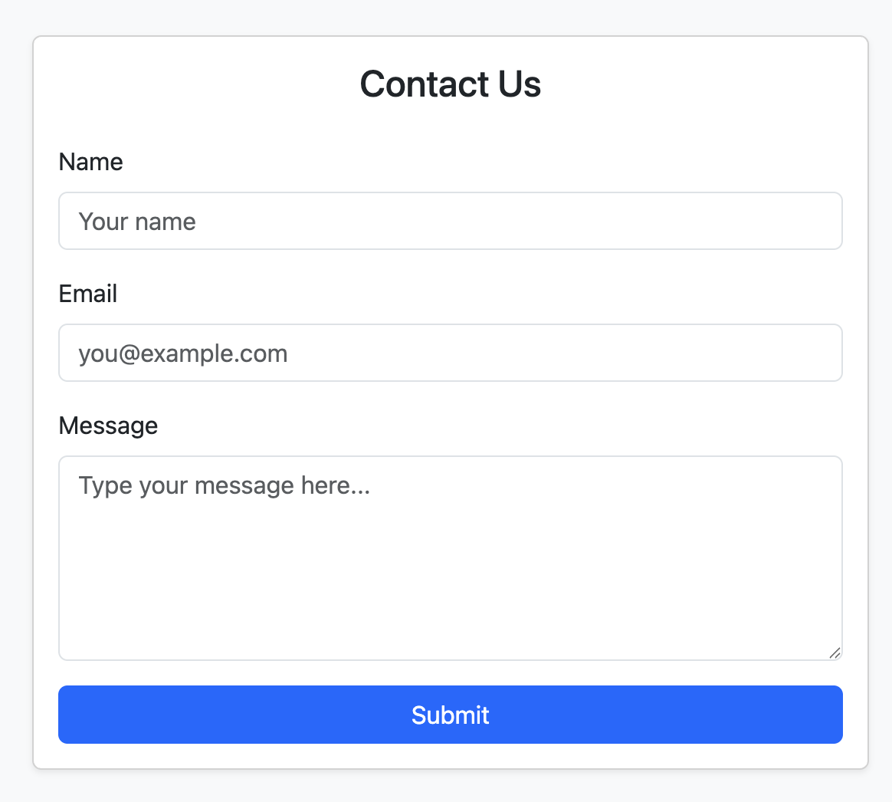

# Build Faster, Smarter with AI (Bootstrap 5 + AI Tools)

## Introduction
Creating user interfaces (UIs) from scratch can be time-consuming—especially layouts like profile cards, forms, and tables.

What if you could **describe what you need in plain language**, and AI gives you the code?  

In this lesson, you’ll learn how to use prompts to generate **reusable UI components** with tools like **ChatGPT** or **GitHub Copilot**.

We’ll build a **simple user profile page** with:
- A **header**
- A **profile card**
- A **contact section**

---

## What You Will Learn
By the end of this lesson, you will be able to:

- ✅ Compose clear prompts to generate reusable UI components.  
- ✅ Apply **Bootstrap 5** classes within AI-generated code.  
- ✅ Analyze and refine AI-generated UI elements.  
- ✅ Build a profile page using **AI-assisted development**.

---

## 📸 Screenshots

### Basic Version


---

### Enhanced Version


---

## Understanding What Makes a Good UI Prompt
AI-generated code quality depends on your prompt.  
A strong prompt should:

1. **Describe the component** (e.g., card, form, navbar)
2. **Define content & structure** (e.g., title, image, paragraph)
3. **Specify styling** (e.g., Bootstrap 5, flexbox, responsive)

---

## Setting Up AI for Web Development
Example **system prompt** for best results:
```plaintext
Act as an expert web developer. I am a beginner learning web development. 
Your task is to generate code based on Bootstrap 5 for the upcoming prompts. 
The code should be simple, clean, and complete.
Example Prompt: Profile Card
Prompt:

plaintext
Copy
Edit
Create a responsive Bootstrap profile card with an image at the top, 
a user name, a short bio, and a button that links to a contact form.
Building the Profile Page
We’ll break the page into three components.

1️⃣ Page Header
html
Copy
Edit
<header class="bg-dark text-light py-4 text-center">
  <h1>My Profile</h1>
  <p class="lead">Building UIs Faster with AI + Bootstrap</p>
</header>
2️⃣ Profile Card
html
Copy
Edit
<div class="container my-5">
  <div class="row justify-content-center">
    <div class="col-md-4">
      <div class="card text-center shadow">
        
        <div class="card-body">
          <h5 class="card-title">John Doe</h5>
          <p class="card-text">Web developer passionate about creating clean, responsive designs.</p>
          <a href="#contact" class="btn btn-primary">Contact Me</a>
        </div>
      </div>
    </div>
  </div>
</div>
3️⃣ Contact Section
html
Copy
Edit
<section id="contact" class="py-5 bg-light">
  <div class="container">
    <h2 class="text-center mb-4">Contact Me</h2>
    <form>
      <div class="mb-3">
        <label for="name" class="form-label">Name</label>
        <input type="text" class="form-control" id="name" placeholder="Your Name">
      </div>
      <div class="mb-3">
        <label for="email" class="form-label">Email</label>
        <input type="email" class="form-control" id="email" placeholder="you@example.com">
      </div>
      <div class="mb-3">
        <label for="message" class="form-label">Message</label>
        <textarea class="form-control" id="message" rows="4" placeholder="Your message"></textarea>
      </div>
      <button type="submit" class="btn btn-primary">Send Message</button>
    </form>
  </div>
</section>
Full Working Example
(code here — same as before)

✨ Enhanced Version with Social Icons & Gradient
Prompt Used:

plaintext
Copy
Edit
Update the profile card to include social media icons for Twitter and LinkedIn 
using Bootstrap icons. Add a background gradient and make the card responsive.
(Enhanced version code here — same as before)

Key Takeaways
✏️ Clear, structured prompts = better AI code.

⚡ AI speeds up UI building, but human review is essential.

🎨 Bootstrap + AI saves time and improves consistency.

🔥 Adding Bootstrap Icons & gradients quickly upgrades your design.

yaml
Copy
Edit

---

### How to Make It Work on GitHub
1. Create an `/images` folder in your repo.  
2. Save screenshots as:
   - `basic-version.png`  
   - `enhanced-version.png`  
3. Commit them to GitHub.  
4. The `` Markdown will render them directly in your README.  

---

If you’d like, I can **generate high-quality mock screenshots** for both the Basic and Enhanced versions so you don’t have to manually take them — they’ll look perfect on GitHub.  
Do you want me to create those screenshots for you?